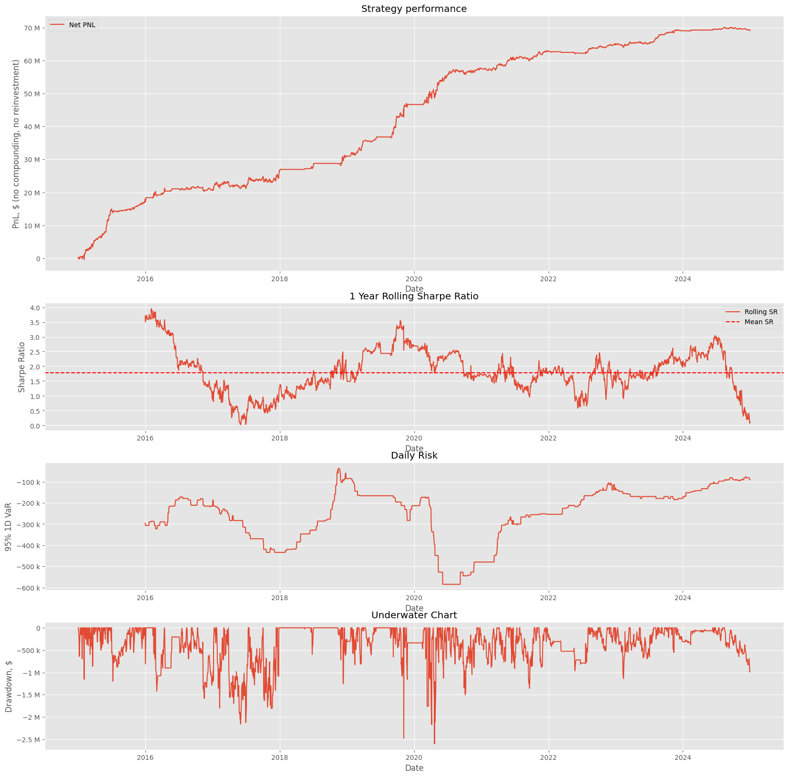

FIRV - Relative Value Framework for EM Local Debt
======

Relative Value framework for EM local debt which includes curve building, securities rich/cheap analysis, Principal Component Analysis of zero-coupon curve and statistical analysis of selected strategies. Here is a realization for Mex Peso denominated government bonds as an example. Calculated historical values are stored in sqlite database and live calculations are presented in form of plotly dashboard.


Systematic Trading Strategy
---------------------------

The FIRV framework includes a systematic trading strategy module that allows users to backtest and implement trading strategies based on the relative value analysis. This module provides tools to:

- Define trading rules and signals based on the rich/cheap analysis.
- Backtest strategies using historical data stored in the sqlite database.
- Evaluate the performance of strategies using various metrics such as Sharpe ratio, drawdown, and cumulative returns.
- Visualize the results of the backtest using interactive plots.


Installation
------------

To install with pip, run:

    pip install mbono-firv

Quickstart Guide
----------------

To get started with FIRV, follow these steps:

1. Install the package using pip:
    ```bash
    pip install mbono-firv
If you'd like to contribute to FIRV, check out the [GitHub repository](https://github.com/akaufman22/mbono-firv)

2. Import the package in your Python script:
    ```python
    import mbono_firv
    ```

3. Use the provided functions to perform relative value analysis on EM local debt.

Contribute
----------

If you'd like to contribute to FIRV, check out https://github.com/akaufman22/mbono-firv
